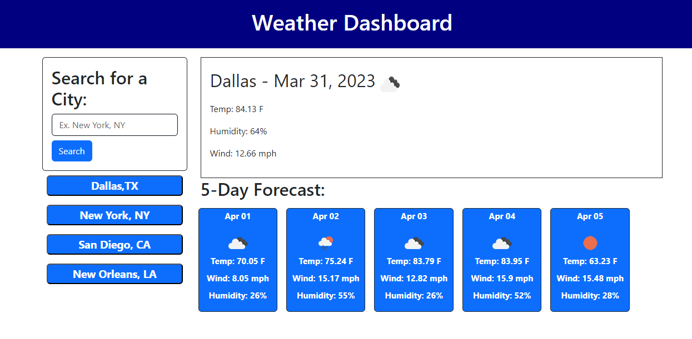

# Weather Dashboard

## Description

Setup a weather dashboard to display current weather conditions for a location as well as a 5-day forecast. Searhed locations are stored for the user so that when they come back to the dashboard they are able to select the saved location instead of having to search for it again.

## Usage

Screenshot

## Deployment

https://jenwariner19.github.io/weather-dashboard/

## Languages

HTML, CSS, JavaScript

## Credits

Worked with tutor Chris Baird, class instructor Tyler, and classmate Shannon Price